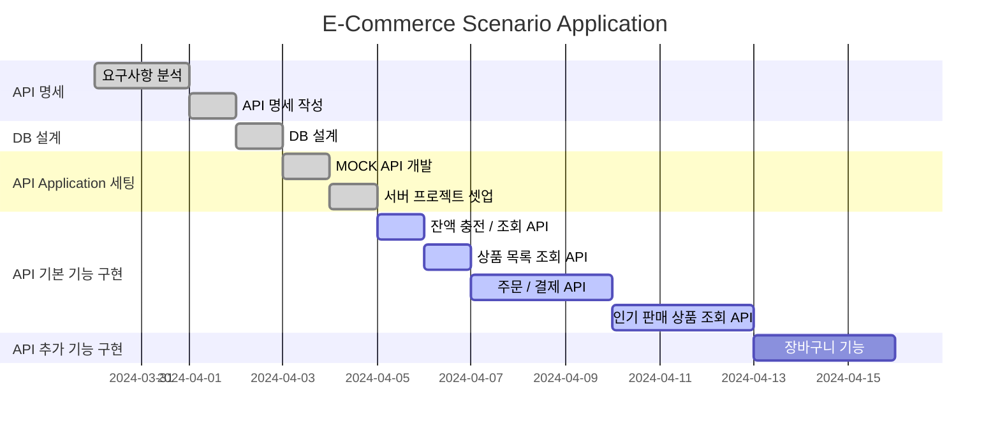
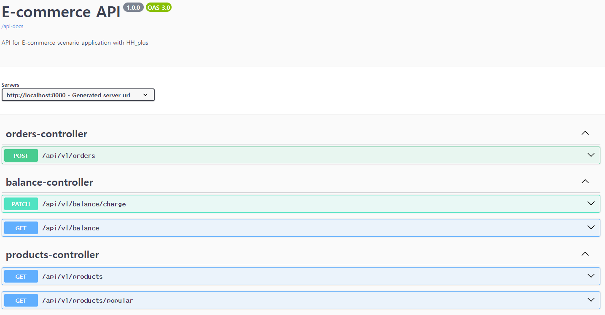
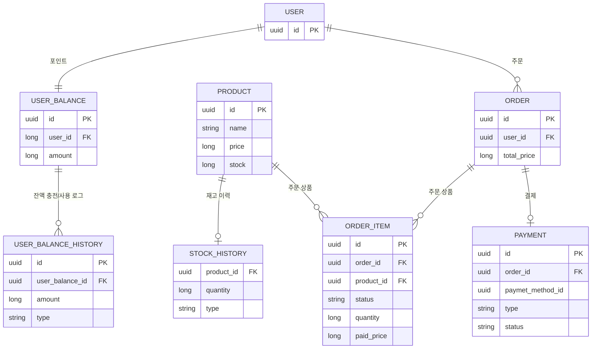

# 프로젝트 마일스톤

# 요구사항

| 번호 | 요구사항        | 설명                                 | 유형  | 구현 여부 | 비고 |
|----|-------------|------------------------------------|-----|-------|----|
| 1  | 잔액 충전       | 사용자는 잔액을 충전할 수 있다.                 | 기능  |       |    |
| 2  | 잔액 조회       | 사용자는 잔액을 조회할 수 있다.                 | 기능  |       |    |
| 3  | 상품 목록 조회    | 사용자는 상품 목록을 조회할 수 있다.              | 기능  |       |    |
| 4  | 주문          | 사용자는 상품을 주문/결제할 수 있다.              | 기능  |       |    |
| 5  | 인기 판매 상품 조회 | 사용자는 인기 판매 상품을 조회할 수 있다.           | 기능  |       |    |
| 6  | 주문          | 마지막 재고에 여러 주문이 들어오는 경우 첫 주문만 허용한다. | 비기능 |       |    |
| 7  | 주문          | 잔액이 부족한 경우 주문을 거부한다.               | 비기능 |       |    |
| 8  | 주문          | 재고가 부족한 경우 주문을 거부한다.               | 비기능 |       |    |
| 9  | 주문          | 주문 완료시 데이터 레이크로 주문 정보를 송신한다.       | 비기능 |       |    |
| 10 | 잔액 충전       | 충전 금액이 적절하지 않은 경우 충전을 거부한다.        | 비기능 |       |    |
| 11 | 잔액 충전       | 충전 금액이 적절하지 않은 경우 충전을 거부한다.        | 비기능 |       |    |

# API 명세 및 플로우 차트

## Swagger-UI

## Authorization

Bearer token 대신 userId 값으로 사용자를 식별한다.
이후 jwt 로 대체한다.

## [잔액 API](./docs/api/balance.md)

- 잔액 조회
- 잔액 충전

## [상품 API](./docs/api/products.md)

- 상품 목록 조회
- 인기 상품 조회

## [주문 API](./docs/api/orders.md)

- 주문

# ERD

