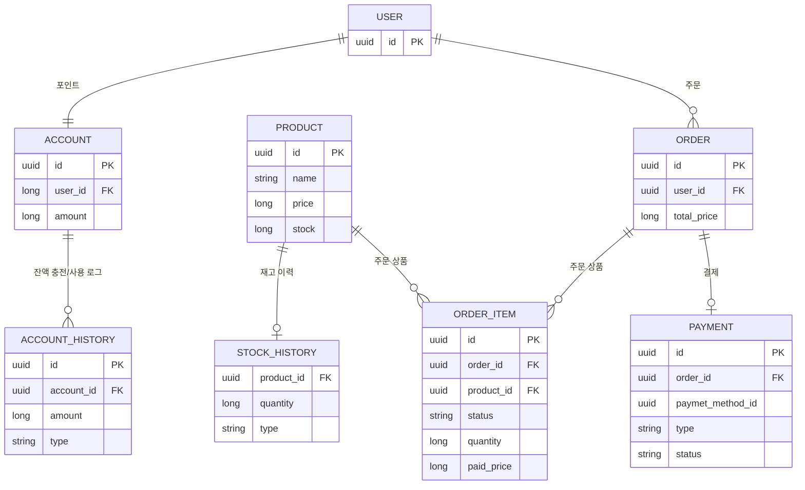

# 프로젝트 마일스톤

- [Gant Chart](./docs/project/gant.md)

# 요구사항

- [IA Table](./docs/project/requirement.md)

# API 명세 및 플로우 차트

## Swagger-UI

## Authorization

Bearer token 대신 userId 값으로 사용자를 식별한다.
이후 jwt 로 대체한다.

## [잔액 API](./docs/api/account.md)

- 잔액 조회
- 잔액 충전

## [상품 API](./docs/api/products.md)

- 상품 목록 조회
- 인기 상품 조회

## [주문 API](./docs/api/orders.md)

- 주문

# ERD

# Branch Strategy

## Branches

### `feature`

기능 단위로 개발 및 테스트가 이루어지는 브랜치. github issue 를 할당받을 수 있다. ex) [#1] feature/oauth

### `dev`

`featrue` 브랜치를 자유롭게 커밋할 수 있는 개발 브랜치로 여러 feature 가 동시에 존재할 수 있다.

### `stage`

`feature` 브랜치를 배포 환경에서 테스트하기 위한 브랜치로, 프로덕션에 올리고 싶은 feature 만 PR 할 수 있다.

### `main`

프로덕션 환경 브랜치

## Integration Policy

### `feature` -> `dev`

Merge & PR :ok:

### `feature` -> `stage`

Only PR :ok:

### `stage` -> `prod`

Only PR :ok: