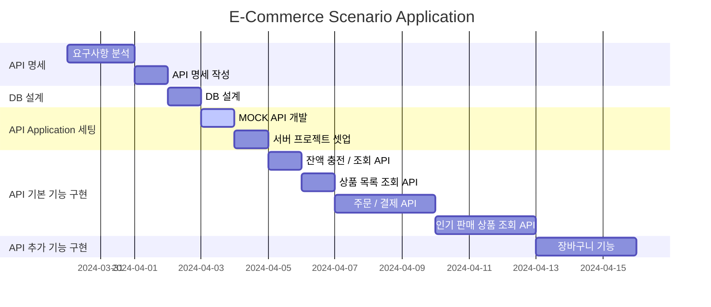
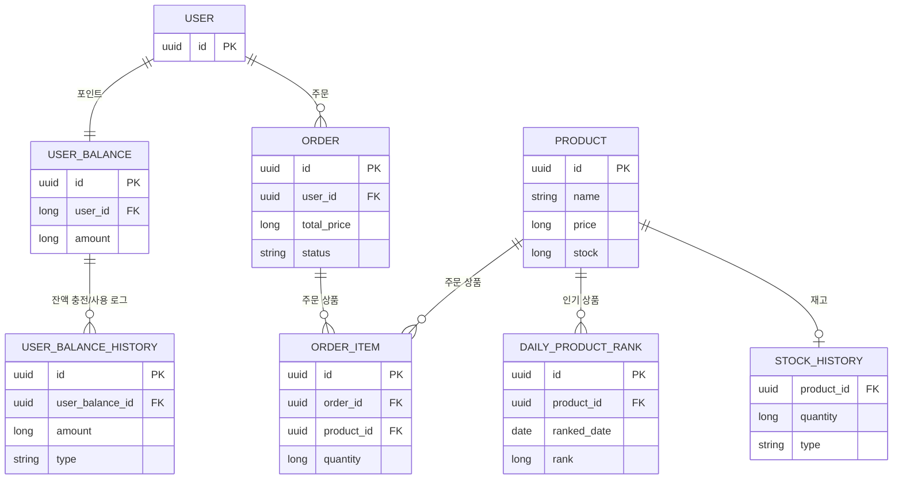

# 프로젝트 마일스톤



# 시나리오 요구사항 분석

| 번호 | 요구사항        | 설명                                 | 유형  | 구현 여부 | 비고 |
|----|-------------|------------------------------------|-----|-------|----|
| 1  | 잔액 충전       | 사용자는 잔액을 충전할 수 있다.                 | 기능  |       |    |
| 2  | 잔액 조회       | 사용자는 잔액을 조회할 수 있다.                 | 기능  |       |    |
| 3  | 상품 목록 조회    | 사용자는 상품 목록을 조회할 수 있다.              | 기능  |       |    |
| 4  | 주문          | 사용자는 상품을 주문/결제할 수 있다.              | 기능  |       |    |
| 5  | 인기 판매 상품 조회 | 사용자는 인기 판매 상품을 조회할 수 있다.           | 기능  |       |    |
| 6  | 주문          | 마지막 재고에 여러 주문이 들어오는 경우 첫 주문만 허용한다. | 비기능 |       |    |
| 7  | 주문          | 잔액이 부족한 경우 주문을 거부한다.               | 비기능 |       |    |

# API 명세

**Authorization**: Bearer token 대신 userId 값으로 사용자를 식별한다.
Session 로그인 기능이 들어온 이후 jwt 로 대체한다.

### 잔액 충전

- Request
    - Method: POST
    - URL: /api/v1/balance/charge
    - Header:
        - Content-Type: application/json
        - Authorization: Bearer {token}
    - Body:
        ```json
        {
            "amount": 0
        }
        ```
- Response
    - 200 OK: 성공적으로 충전
        ```json
        {
            "code": "OK",
            "data": {
                "balance": 0
            }
        }
        ```
    - 400 Bad Request: 충전 금액이 적절하지 않은 경우
        ```json
        {
            "code": "BAD_REQUEST",
            "message": "requested amount is not valid"
        }
        ```
    - 401 Unauthorized: 유저 토큰이 유효하지 않은 경우
        ```json
        {
            "code": "UNAUTHORIZED",
            "message": "user token is not valid"
        }
        ```
    - 404 Not Found User: 유저 정보가 없는 경우
        ```json
        {
            "code": "NOT_FOUND",
            "message": "no user information was found"
        }
        ```

### 잔액 조회

- Request
    - Method: GET
    - URL: /api/v1/balance
    - Header:
        - Content-Type: application/json
        - Authorization: Bearer {token}
- Response
    - 200 OK: 성공적으로 조회
        ```json
        {
            "code": "OK",
            "data": {
                "userId": 1,
                "balance": 0
            }
        }
        ```
    - 401 Unauthorized: 유저 토큰이 유효하지 않은 경우
        ```json
        {
            "code": "UNAUTHORIZED",
            "message": "user token is not valid"
        }
        ```
    - 404 Not Found User: 유저 정보가 없는 경우
        ```json
        {
            "code": "NOT_FOUND",
            "message": "no user information was found"
        }
        ```

### 상품 목록 조회

- Request
    - Method: GET
    - URL: /api/v1/products
    - Header:
        - Content-Type: application/json
        - Authorization: Bearer {token}
    - Query:
        - cursor: 1
        - size?: 10
        - sort?: createdAt
        - direction?: desc
        - category?: ${category}
- Response
    - 200 OK: 성공적으로 조회
        ```json
        {
            "code": "OK",
            "data": [
                {
                    "id": 1,
                    "name": "상품1",
                    "price": 1000,
                    "stock": 10
                }
            ],
            "pageInfo": {
                "cursor": 1,
                "size": 10,
                "total": 1,
                "totalPages": 1
            }
        }
        ```
    - 401 Unauthorized: 유저 토큰이 유효하지 않은 경우
        ```json
        {
            "code": "UNAUTHORIZED",
            "message": "user token is not valid"
        }
        ```

### 주문

- Request
    - Method: POST
    - URL: /api/v1/order
    - Header:
        - Content-Type: application/json
        - Authorization: Bearer {token}
    - Body:
        ```json
        { 
           "items": [ 
                { "productId": 1, "quantity": 1 },
                { "productId": 2, "quantity": 2 }
            ],
           "totalPrice": 0
        }
        ```
- Response
    - 200 OK: 성공적으로 주문
        ```json
        {
            "code": "OK",
            "data": {
                "id": 1,
                "totalPrice": 0,
                "balance": 0,
                "status": "ORDERED",
                "items": [
                    {
                        "product": {
                            "id": 1,
                            "name": "상품1",
                            "price": 1000,
                            "stock": 10
                        },
                        "quantity": 1
                    },
                    {
                        "product": {
                            "id": 2,
                            "name": "상품2",
                            "price": 2000,
                            "stock": 10
                        },
                        "quantity": 2
                    }
                ]
            }
        }
        ```
    - 400 Bad Request: 주문 상품이 적절하지 않은 경우
        ```json
        {
            "code": "BAD_REQUEST",
            "message": "order item is not valid"
        }
        ```
    - 401 Unauthorized: 유저 토큰이 유효하지 않은 경우
        ```json
        {
            "code": "UNAUTHORIZED",
            "message": "user token is not valid"
        }
        ```
    - 404 Not Found User: 유저 정보가 없는 경우
        ```json
        {
            "code": "NOT_FOUND",
            "message": "no user information was found"
        }
        ```
    - 404 Not Found Product: 상품 정보가 없는 경우
        ```json
        {
            "code": "NOT_FOUND",
            "message": "no product information was found"
        }
        ```
    - 422 Insufficient Product Stock: 재고가 부족한 경우
        ```json
        {
            "code": "INSUFFICIENT_PRODUCT_STOCK",
            "message": "product stock is insufficient"
        }
        ```
    - 422 Insufficient Balance: 잔액이 부족한 경우
        ```json
        {
            "code": "INSUFFICIENT_BALANCE",
            "message": "balance is insufficient"
        }
        ```

### 인기 판매 상품 조회

- Request
    - Method: GET
    - URL: /api/v1/products/popular
    - Header:
        - Content-Type: application/json
        - Authorization: Bearer {token}
    - Query:
        - cursor: 1
        - size?: 10
        - sort?: createdAt
        - direction?: desc
        - category?: ${category}
- Response
    - 200 OK: 성공적으로 조회
        ```json
        {
            "code": "OK",
            "data": [
                {
                    "id": 1,
                    "name": "상품1",
                    "price": 1000,
                    "stock": 10
                }
            ],
            "pageInfo": {
                "cursor": 1,
                "size": 10,
                "total": 1,
                "totalPages": 1
            }
        }
        ```
    - 401 Unauthorized: 유저 토큰이 유효하지 않은 경우
        ```json
        {
            "code": "UNAUTHORIZED",
            "message": "user token is not valid"
        }
        ```

# ERD

