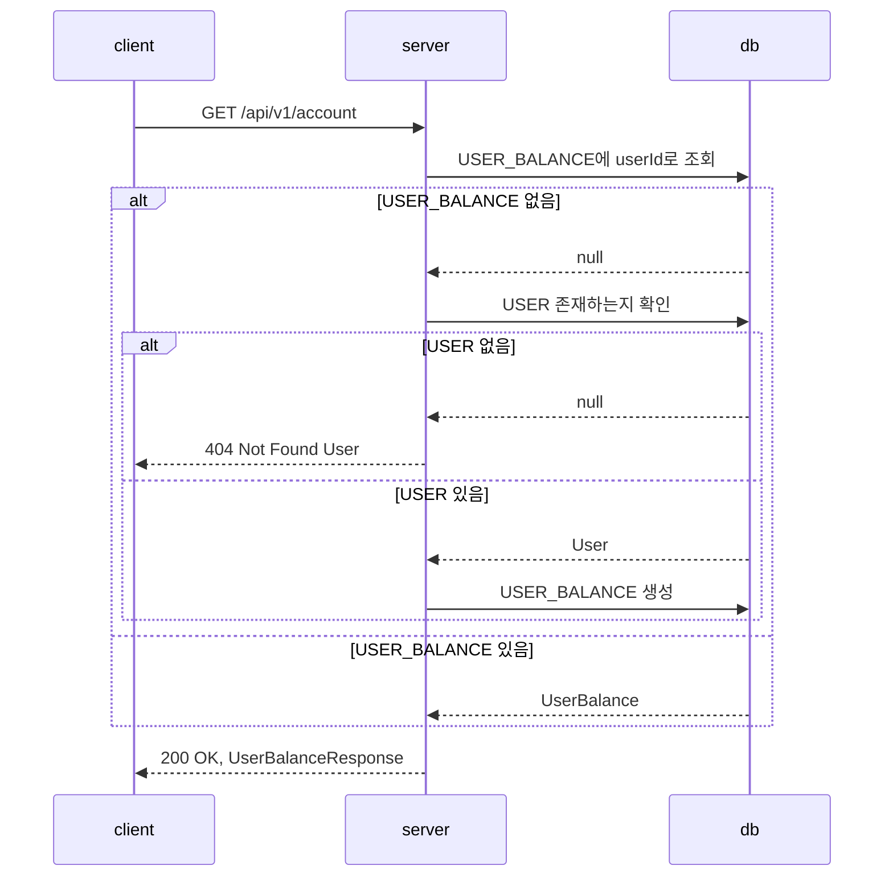
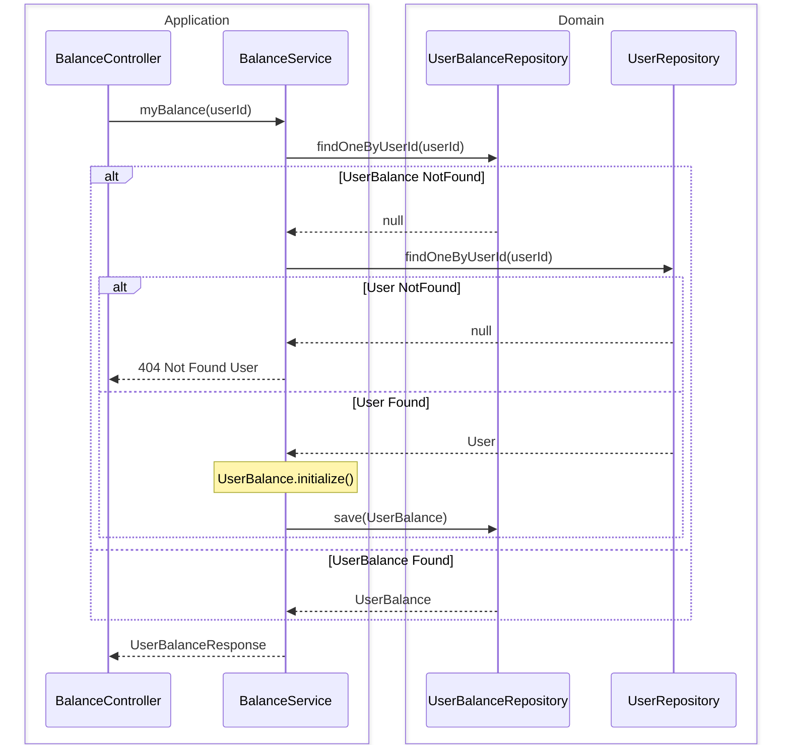
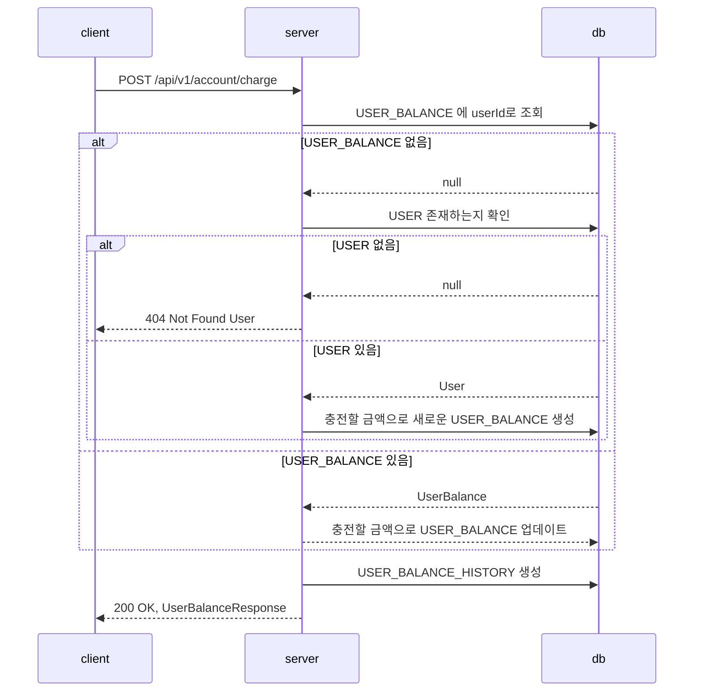
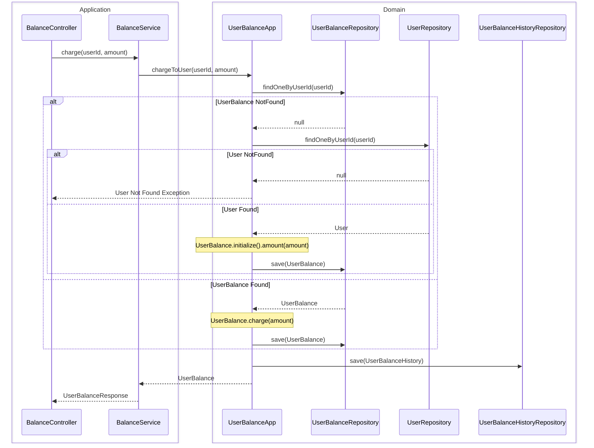

# 잔액 API

## 잔액 조회

### API 명세

- Request
    - Method: GET
    - URL: /api/v1/account
    - Header:
        - Content-Type: application/json
        - Authorization: Bearer {token}
- Response
    - 200 OK: 성공적으로 조회
        ```json
        {
            "id": "uuid",
            "userId": "uuid",
            "balance": 0
        }
        ```
    - 401 Unauthorized: 유저 토큰이 유효하지 않은 경우
        ```json
        {
            "code": "UNAUTHORIZED",
            "message": "user token is not valid"
        }
        ```
    - 404 Not Found User: 유저 정보가 없는 경우
        ```json
        {
            "code": "NOT_FOUND",
            "message": "no user information was found"
        }
        ```

### 플로우 차트



#### server



## 잔액 충전

### API 명세

- Request
    - Method: POST
    - URL: /api/v1/account/charge
    - Header:
        - Content-Type: application/json
        - Authorization: Bearer {token}
    - Body:
        ```json
        {
            "amount": 0
        }
        ```
- Response
    - 200 OK: 성공적으로 충전
        ```json
        {
            "id": "uuid",
            "userId": "uuid",
            "balance": 0
        }
        ```
    - 400 Bad Request: 충전 금액이 적절하지 않은 경우
        ```json
        {
            "code": "BAD_REQUEST",
            "message": "requested amount is not valid"
        }
        ```
    - 401 Unauthorized: 유저 토큰이 유효하지 않은 경우
        ```json
        {
            "code": "UNAUTHORIZED",
            "message": "user token is not valid"
        }
        ```
    - 404 Not Found User: 유저 정보가 없는 경우
        ```json
        {
            "code": "NOT_FOUND",
            "message": "no user information was found"
        }
        ```

### 플로우 차트



#### Server

