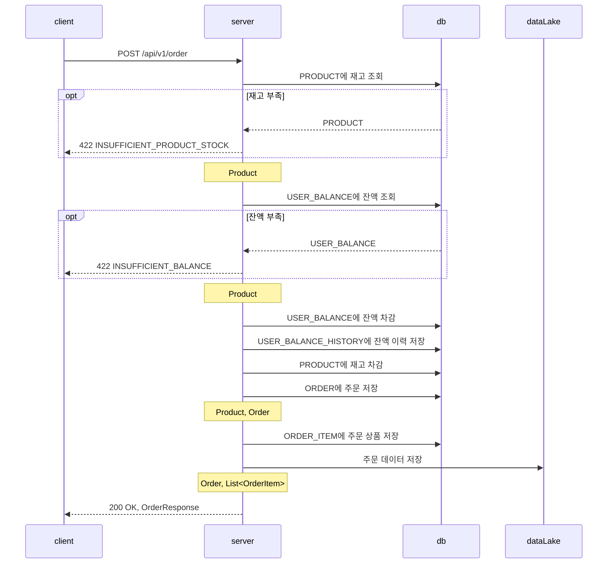
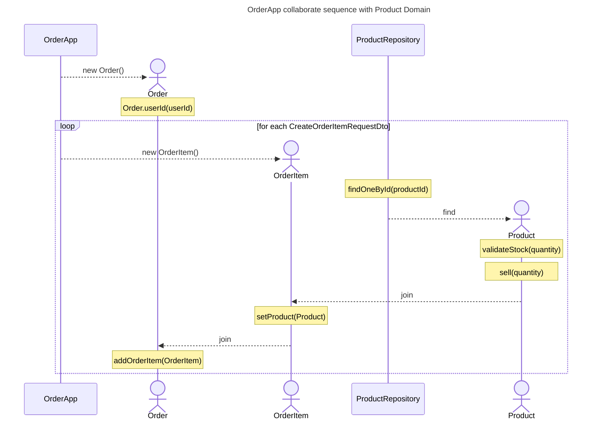
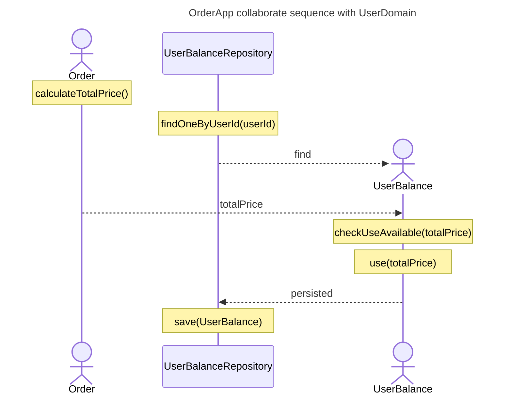
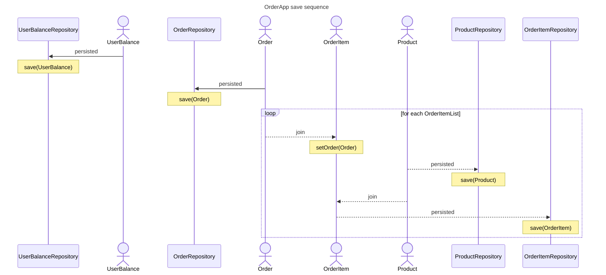

# 주문 API

## 주문

### API 명세

- Request
    - Method: POST
    - URL: /api/v1/order
    - Header:
        - Content-Type: application/json
        - Authorization: Bearer {token}
    - Body:
        ```json
        { 
           "items": [ 
                { "productId": "uuid", "quantity": 1 },
                { "productId": "uuid", "quantity": 2 }
            ],
           "totalPrice": 0
        }
        ```
- Response
    - 200 OK: 성공적으로 주문
        ```json
        {
            "code": "OK",
            "data": {
                "id": "uuid",
                "totalPrice": 0,
                "items": [
                    {
                        "id": "uuid",
                        "orderId": "uuid",
                        "product": {
                            "id": "uuid",
                            "name": "상품1",
                            "price": 1000,
                            "stock": 10
                        },
                        "quantity": 1,
                        "status": "ORDERED"
                    },
                    {
                        "id": "uuid",
                        "orderId": "uuid",
                        "product": {
                            "id": "uuid",
                            "name": "상품2",
                            "price": 2000,
                            "stock": 10
                        },
                        "quantity": 2,
                        "status": "ORDERED"
                    }
                ]
            }
        }
        ```
    - 400 Bad Request: 주문 상품이 적절하지 않은 경우
        ```json
        {
            "code": "BAD_REQUEST",
            "message": "order item is not valid"
        }
        ```
    - 401 Unauthorized: 유저 토큰이 유효하지 않은 경우
        ```json
        {
            "code": "UNAUTHORIZED",
            "message": "user token is not valid"
        }
        ```
    - 404 Not Found User: 유저 정보가 없는 경우
        ```json
        {
            "code": "NOT_FOUND",
            "message": "no user information was found"
        }
        ```
    - 404 Not Found Product: 상품 정보가 없는 경우
        ```json
        {
            "code": "NOT_FOUND",
            "message": "no product information was found"
        }
        ```
    - 422 Insufficient Product Stock: 재고가 부족한 경우
        ```json
        {
            "code": "INSUFFICIENT_PRODUCT_STOCK",
            "message": "product stock is insufficient"
        }
        ```
    - 422 Insufficient Balance: 잔액이 부족한 경우
        ```json
        {
            "code": "INSUFFICIENT_BALANCE",
            "message": "balance is insufficient"
        }
        ```

### 플로우 차트

#### Rest API



#### server

- Product Domain 으로부터 재고 검증



- Balance Domain 으로부터 잔액 검증



- Persistence


