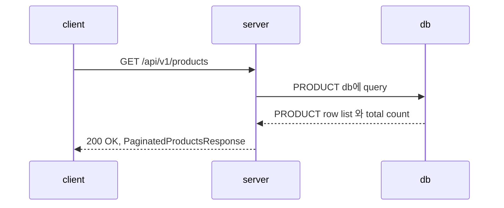
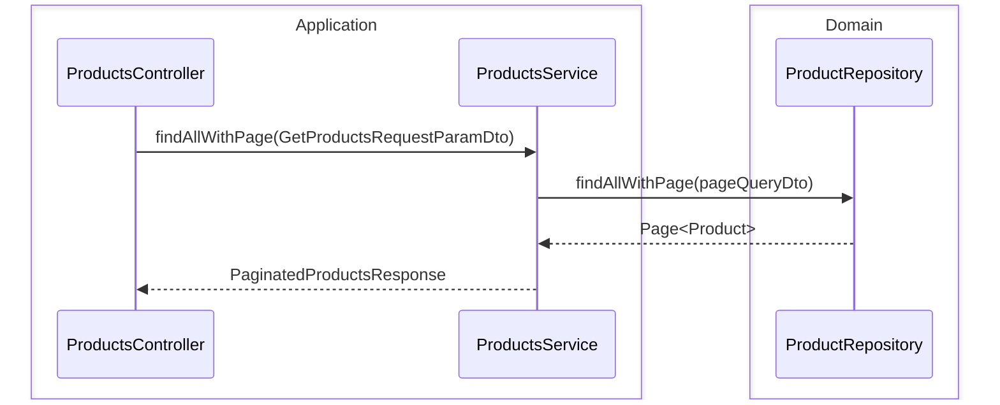
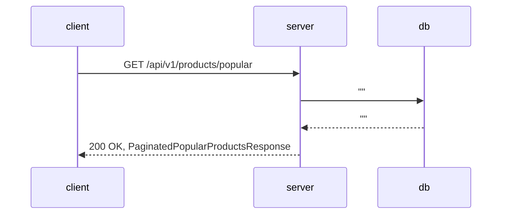
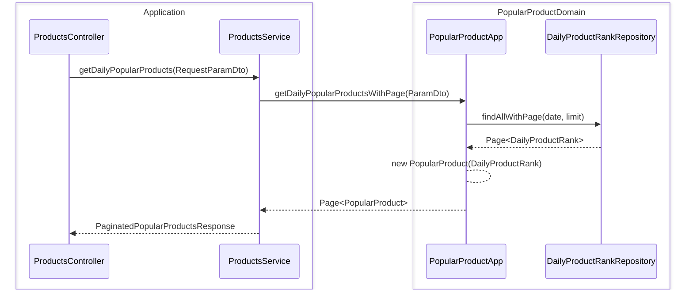

# 상품 API

## 상품 목록 조회

### API 명세

- Request
    - Method: GET
    - URL: /api/v1/products
    - Header:
        - Content-Type: application/json
        - Authorization: Bearer {token}
    - Query:
        - cursor: 1
        - size?: 10
        - sort?: createdAt
        - direction?: desc
        - category?: ${category}
- Response
    - 200 OK: 성공적으로 조회
        ```json
        {
            "items": [
                {
                    "id": 1,
                    "name": "상품1",
                    "price": 1000,
                    "stock": 10
                }
            ],
            "pageInfo": {
                "cursor": 1,
                "size": 10,
                "total": 1,
                "totalPages": 1,
                "order": {
                    "createdAt": "desc"
                }
            }
        }
        ```
    - 401 Unauthorized: 유저 토큰이 유효하지 않은 경우
        ```json
        {
            "code": "UNAUTHORIZED",
            "message": "user token is not valid"
        }
        ```

### 플로우 차트



#### server



## 인기 상품 조회

### API 명세

- Request
    - Method: GET
    - URL: /api/v1/products/popular
    - Header:
        - Content-Type: application/json
        - Authorization: Bearer {token}
    - Query:
        - cursor: 1
        - size?: 10
        - sort?: createdAt
        - direction?: desc
        - category?: ${category}
- Response
    - 200 OK: 성공적으로 조회
        ```json
        {
            "items": [
                {
                    "id": 1,
                    "name": "상품1",
                    "price": 1000,
                    "stock": 10,
                    "sellCountByDaily": 1
                }
            ],
            "metadata": {
                "rankedAt": "2024-04-04T00:00:00Z"
            },
            "pageInfo": {
                "cursor": 1,
                "size": 10,
                "total": 1,
                "totalPages": 1,
                "order": {
                    "sellCountByDaily": "desc"
                }
            }
        }
        ```
    - 401 Unauthorized: 유저 토큰이 유효하지 않은 경우
        ```json
        {
            "code": "UNAUTHORIZED",
            "message": "user token is not valid"
        }
        ```
    - 422 Unprocessable Entity: 아직 집계가 완료되지 않은 경우
        ```json
        {
            "code": "UNPROCESSABLE_ENTITY",
            "message": "batching is not completed yet"
        }
        ```  

### 플로우 차트



#### server

