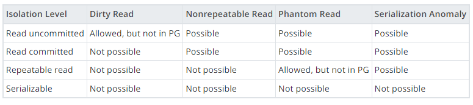

# 동시성 제어

> 🚨 다중 어플리케이션 환경에서 요청된 API 간의 데이터 무결성, 일관성을 보장해야 한다.

> ### Postgres
> 1. MVCC(Multiversion Concurrency Control) 모델로, non-serialized transaction 간의 동시성을 제어함으로써 데이터 일관성을 유지해야 한다.
> 2. Default Isolation Level = `Read Committed`  
     

## 오손 읽기 (Dirty Read) 문제

> 트랜잭션이 아직 종료되지 않았는데, 일부의 갱신된 값을 조회하여 데이터의 일관성이 무너지는 문제.    
> 또는 조회 이후에 트랜잭션이 롤백되어 데이터 무결성이 무너지는 문제

✍🏻 **주문 기능**

주문이 완료되지 않았는데 재고/잔액이 감소하거나, 추후에 주문이 롤백되었는데 조회된 재고/잔액이 실제 데이터와 일치하지 않을 수 있다.

---

### 1. 데이터베이스 트랜잭션 ✅

> 격리 수준을 조정함으로써 오손 읽기 문제를 해결할 수 있다.

**`Read Committed`** ✅  
모든 커맨드는 커밋된 기록에만 접근하므로 오손 읽기 문제는 발생하지 않는다.

**`Repeatable Read`** ❌  
이전 수준보다 동시성 수준이 떨어지고, 트랜잭션 중에 반복 가능한 읽기가 필요하지 않다.

### 2. 분산락

TBU

### 3. 메시지 브로커

TBU

---

## 갱신 손실 (Lost Update / Dirty Write)

> 다음 트랜잭션이 이전 트랜잭션의 갱신을 덮어 쓰는 문제.

✍🏻 **잔액 충전/사용**  
✍🏻 **재고 감소**  
값을 조회한 후 값을 갱신하는 비즈니스 로직 특성 상, 현재 트랜잭션의 갱신 결과를 대기해야 한다.

### Explicit Low-level locking

MVCC 기반의 모델에 `Read commited` 이상의 고립 수준에서   
단순히 `select` 문을 사용하면 각 트랜잭션은 동시에 들어온 다른 트랜잭션의 커밋을 기다리지 않는다.  
명시적으로 락 기능을 설정하여 해결하자.

#### Optimistic Locking ❌

읽기 + 쓰기 충돌이 빈번하므로 사용하지 않는다.

#### Pessimistic Locking

**`select for share`** ❌

- 서로 다른 트랜잭션 간에 공유 락이 설정됨으로써 같은 row 에 대한 조회가 가능하다.
- 하지만 한 트랜잭션이 update 쿼리를 실행하면 dead lock이 발생한다.  
  postgres 특성 상 update 문은 자동적으로 배타 락을 획득하려고 하기 때문이다.

**`select for update`** ✅

- select 문이 update 가 마무리되기 전까지 대기한다.
    ```
    select * from account where id = 1 for update; -- 조회
    update account set balance = 100 where id = 1; -- 사용 or 충전
    ```
