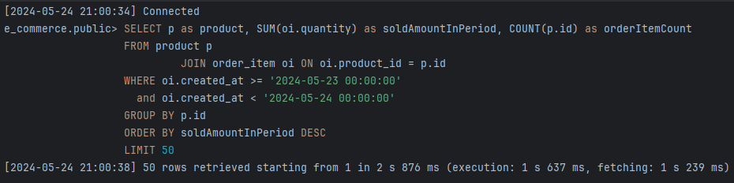

# 부하 테스트

## 포인트 충전, 사용 API

> account update query 시 database optimistic lock 을 걸어두었다.  
> 어느 정도의 성능 영향이 있는지를 확인한 후 배포 환경의 적정 가용량을 분석한다.

## 주문 API

> product update query 시 database optimistic lock 을 걸어두었다.  
> 이벤트와 같이 주문이 특정 시간에 몰리는 경우에 어떤 영향을 미치는지 확인한다.

## 결제 API

> 주문 확인, 외부 결제 API 호출, 포인트 감소 로직을 포함한다.  
> 또는 보상 트랜잭션으로서 재고를 다시 복구하는 로직을 수행할 수 있다.
> 1. 기존의 동기 호출 방식이 대용량 트래픽 처리 성능을 확인한다.
> 2. 새 버전의 이벤트 기반 비동기 방식을 도입하여 성능을 확인한다.

## 인기 상품 조회 API

> 기존 API 는 요청 즉시 당일 판매량을 계산하고 있다.  
> 이는 캐싱을 통해 성능을 개선할 수 있지만, 하나의 커넥션이 무거운 연산에 붙잡히는 비효율이 발생한다.
> 따라서 통계 테이블과 batch process 를 통해 성능을 개선할 수 있는지 확인한다.

### 1. JOIN QUERY 직접 적용

현재 인기 상품 조회 쿼리는 다음과 같다.

```sql
SELECT p, SUM(oi.quantity) as total
FROM product p
         JOIN order_item oi ON p.id = oi.product_id
-- WHERE ...
GROUP BY p.id
ORDER BY total DESC
```

10만건의 order_item 기준 1106ms 소요
